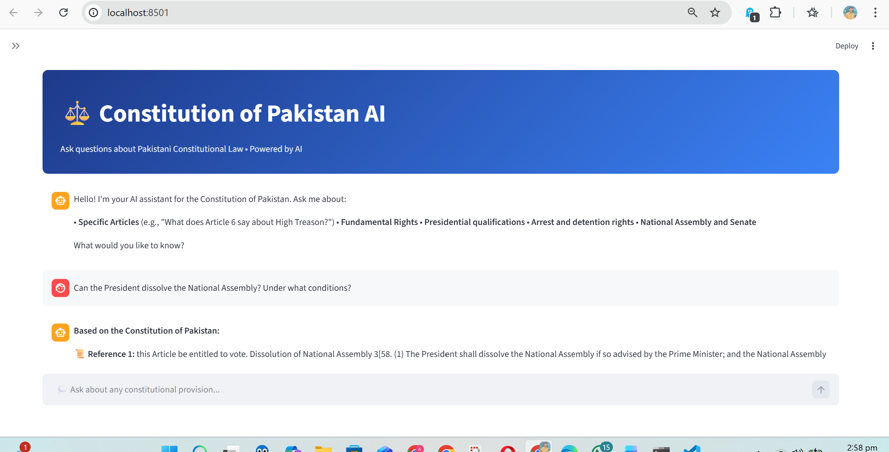
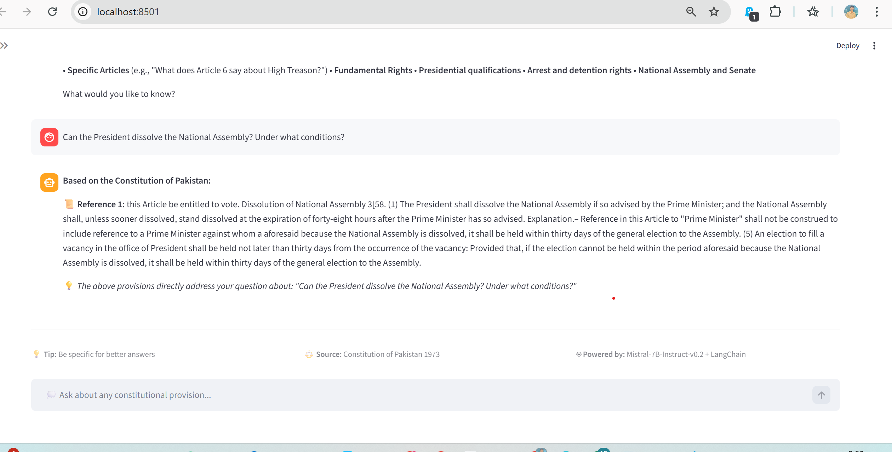
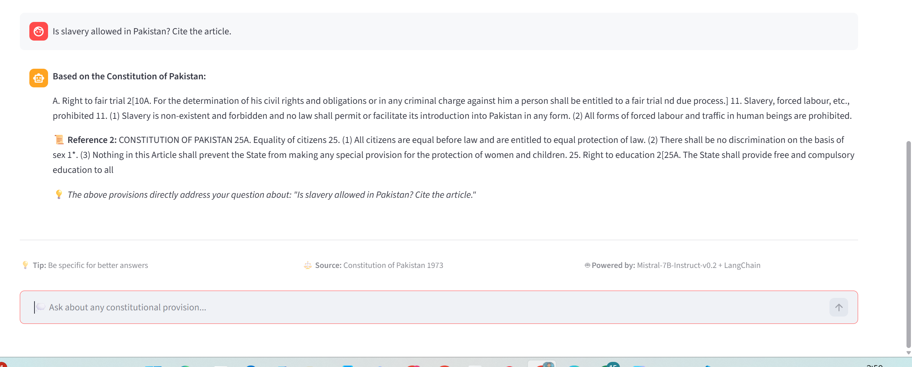

# ⚖️ Constitutional-AI: Intelligent RAG Legal Assistant
*Bridging the gap between Complex Law and Citizen Accessibility using LangChain & Mistral-7B*

---

## 🌟 Overview
**Constitutional-AI** is a high-performance **Retrieval-Augmented Generation (RAG)** system designed to provide accurate, verifiable, and citation-backed answers from the **Constitution of Pakistan (1973)**. 

Unlike standard AI models that may "hallucinate" or provide outdated legal information, this application uses a specialized pipeline to ensure every response is mathematically grounded in the official legal PDF.

---

## 📱 Application Preview
Check out the system in action. These screenshots demonstrate the UI/UX and the accuracy of the retrieval process.

| 🏛️ 1. Main Chat Interface | 🔍 2. Article Retrieval Logic |
| :---: | :---: |
|  |  |
| **🛡️ 3. Hallucination-Free Answers** | **📊 4. Interactive Chat History** |
|  |  |

---

## 🧠 Deep Dive: The AI Concepts

### 1. Why RAG (Retrieval-Augmented Generation)?
Standard Large Language Models (LLMs) are like students who have read the entire internet but might forget specific details of a single book. **RAG** changes this. It gives the AI an "Open Book" to reference before it answers. 

**The RAG Advantage:**
* **Zero Hallucination:** The AI is instructed to *only* answer using the provided text.
* **Up-to-Date:** If the law changes, you just update the PDF; no need to retrain the model.
* **Citations:** Every answer can point to a specific Article or Chapter.


### 2. Why LangChain?
LangChain is the **orchestrator** (the glue). It connects the various components of our system. 
* It handles **Document Loading** (parsing the PDF).
* It manages **Chains** (the flow of data from search to the LLM).
* It provides **Memory** so the AI remembers your previous questions in the same session.

---

## 🏗️ Technical Architecture & Approach

The application follows a dual-phase architecture:

### Phase A: The Ingestion Pipeline (`ingest.py`)
1.  **Extraction:** We use `PyPDFLoader` to scrape text from the 100+ page Constitution.
2.  **Recursive Chunking:** We split text into **1000-character chunks** with a **200-character overlap**. This overlap is crucial—it ensures that if a legal definition is split between two chunks, the context is preserved (**Semantic Continuity**).
3.  **Embedding:** We use `all-MiniLM-L6-v2`. This model converts text into a 384-dimensional vector.
    
    $$\text{Similarity}(A, B) = \frac{A \cdot B}{\|A\| \|B\|}$$
    
4.  **Vector Storage:** We use **FAISS** to store these vectors, allowing us to perform "Similarity Search" in milliseconds.


### Phase B: The Retrieval & Generation Pipeline (`app.py`)
1.  **User Query:** The user asks a question, e.g., *"What is Article 6?"*
2.  **Semantic Search:** FAISS finds the top-3 most mathematically similar chunks from the Constitution.
3.  **Context Injection:** These chunks are "stuffed" into a prompt for the LLM.
4.  **Generation:** **Mistral-7B-Instruct-v0.2** (our Generative Model) reads the chunks and writes a professional, human-like response.

---

## 🛠️ The Tech Stack

| Component | Technology | Why? |
| :--- | :--- | :--- |
| **LLM** | Mistral-7B-Instruct-v0.2 | Outperforms Llama-2; highly efficient and accurate. |
| **Embeddings** | all-MiniLM-L6-v2 | Fast, lightweight, and perfect for legal semantic search. |
| **Vector DB** | FAISS | Industrial-grade vector search developed by Meta. |
| **Framework** | LangChain | Standardizes the interaction between models and data. |
| **Frontend** | Streamlit | Provides a clean, responsive web interface for users. |

---

## 🚀 Installation & Usage

1.  **Clone the repository:**
    ```bash
    git clone [https://github.com...)
    ```
2.  **Install dependencies:**
    ```bash
    pip install -r requirements.txt
    ```
3.  **Configure API Access:**
    Create `.streamlit/secrets.toml` and add your Hugging Face Token:
    ```toml
    HF_TOKEN = "your_token_here"
    ```
4.  **Build the Brain:**
    ```bash
    python ingest.py
    ```
5.  **Launch:**
    ```bash
    streamlit run app.py
    ```

---

## 🛠️ Troubleshooting & Limitations
* **API Rate Limits:** Since we use the free Inference API, Hugging Face may limit requests (Error 429). If this happens, wait 60 minutes for the reset.
* **Model Warm-up:** The first query may take ~30 seconds as the model "wakes up" on the server. Subsequent queries are near-instant.
* **Legal Context:** This tool is for **educational purposes**. Always verify with the official Government Gazette for legal proceedings.

---

## ✨ About 
I am an AI Developer passionate about using **Generative AI** and **RAG** to solve real-world accessibility problems. 

